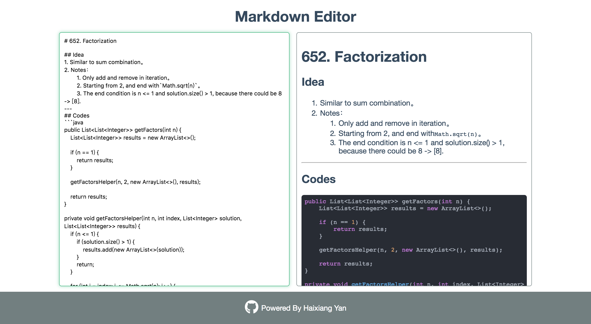

# Markdown-Editor
A markdown editor based on Vue.js, highlight.js and markedJS. The code style is Atom-One-Dark. Enjoy your writing 😉.

## Demo

### Demo

[Try this to start markdowning](https://haixiang6123.github.io/markdown-editor/)

### Screenshot


## How to run

```
cd Markdown-Editor

npm install

npm run serve
```

## Resources
1. [Vue.js](https://cn.vuejs.org/)
2. [MarkedJS](https://github.com/markedjs/marked)
3. [highlight.js](https://highlightjs.org/)
